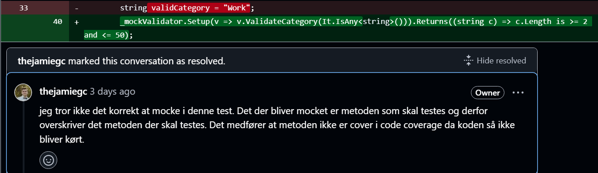
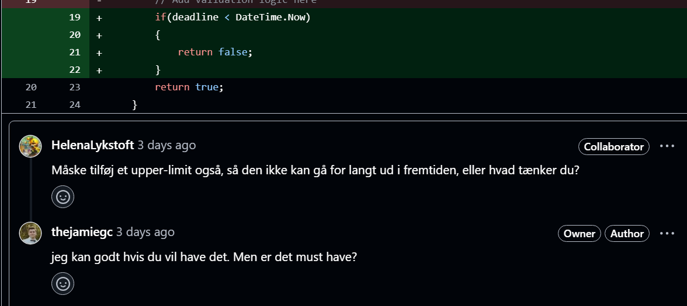

# Task Service with Testing, Code Analysis, and Reviews
 - Group name: **TofuBytes** Members: **Isak, Jamie & Helena**
## Objective
Refine the **Task Service** with a focus on testing, static code analysis, and peer reviews. Apply code and software review principles to ensure quality, covering both automated and manual review processes.

---

## Instructions

### 1. Task Service Refinement
- Implement Task CRUD operations:
    - **Create, Read, Update, Delete** tasks.
    - Enforce business rules (e.g., task title must not be empty, task description must have a minimum length).
- Prioritize clean, readable, and efficient code.

### 2. Unit Testing with Mocking
- Use mocking frameworks (Moq for C#) to isolate external dependencies.
- Write unit tests for core business logic.
- Aim for **75% code coverage**.

### 3. Test Design
- Use **Equivalence Partitioning** and **Boundary Value Analysis**:
    - Test min/max task title lengths.
    - Test valid/invalid task states (e.g., active, completed).
- Implement these test cases and include them in your reports.

### 1., 2. and 3: Refine Task Service, Unit testing and test design
- We made sure to refine our code, and made unit tests for our validator part. We also made sure to use Equivalence Partitioning and Boundary Value Analysis for our tests.
Our unit tests are made based on this data:
- Description length:
  - Valid, too short, too long ( minimum 5, maximum 255)
  - Boundary value: 4-5, 255-256
- Category length:
  - Valid, too short, too long ( minimum 2, maximum 50)
  - Boundary value: 1-2, 50-51
- Deadline:
  - Valid, invalid ( minimum datetime now -1 min, maximum datetime is as long as the calendar can show)
  - Boundary value: now to 1 min ago, now to 1 min in the future

In our Validator.cs file and ValidatorTest.cs, the validator is tested with the above data.

### 4. Static Code Analysis (PMD or FxCop)
- Integrate **PMD** (Java) or **FxCop** (C#) into your build process.
- Fix at least **three critical issues** identified by the static code analyzer.
- Submit the report and the corrected code.

### 5. Code Coverage (JaCoCo or Coverlet)
- Use **JaCoCo** (Java) or **Coverlet** (C#) for code coverage.
- Ensure at least **75% code coverage**.
- Submit the coverage report.

### 6. Optional: Code Quality with SonarQube
- If possible, integrate **SonarQube** for deeper code analysis.
- Address and fix at least **three major issues** detected.
- Submit the SonarQube report (optional).

### 7. Peer Code Review
- Conduct a **code review** with a peer based on principles from the [Code Review](https://en.wikipedia.org/wiki/Code_review) article.
- Focus on:
    - Code readability and maintainability.
    - Adherence to coding standards.
    - Correct use of mocks in tests.
    - Identification of potential bugs.
- Submit written feedback and any suggested code changes.

We always make code review on everyones code. We use github pull requests to review the code, and below are some examples of some reviews we did:

Especially in this last comment, we can see that no one is 'in charge' of the code, and that we are always working together to make sure what works, what doesnt and so on.
We always check the code for readability and maintainability, and make sure that the code is up to our standards.

### 8. Software Review
- Perform a **Software Review** based on the [Software Review](https://en.wikipedia.org/wiki/Software_review) article:
    - Functional correctness: Does the code do what it is supposed to do?
    - Non-functional aspects (performance, maintainability, etc.).
    - Best practices (code structure, documentation).
- Submit a **300-word report** reflecting on your findings and improvements.

In relation to functional correctness, the code performs as expected and passes all the test cases. `Validation_test` was added as a way of ensuring our Validation Testing was done using equivalence partitioning and boundary value analysis. 
For equivalence partitioning, the inputs were divided into valid and invalid categories, ensuring that the code handled typical cases within these partitions correctly. 
Additionally, boundary value analysis revealed that the code responds appropriately at the edges of input ranges, such as minimum and maximum allowable values. However, further testing could be beneficial to expand the test coverage, especially for complex input patterns or extreme edge cases.
We made sure that our software was correct, and that it was easy to maintain. We also made sure that the code was structured in a way that was easy to understand.
The code was made to do what it was supposed to do, and if there were anything that were 'too much' or 'too little', we made sure to fix it.

In relation to best practices, we always try to maintain a clean code structure and follow the coding standards. We make sure to name our methods correctly, so everyone knows what the methods actually do.
We strive to improve documentation, comments is a way we want to reflect that directly in the code.

### 9. Reflection on Testing and Code Quality
- Write a **300-400 word reflection** on:
    - Impact of static code analysis tools (PMD, JaCoCo).
    - Importance of mocking in unit testing.
    - Value of code and software reviews.
    - Influence of Equivalence Partitioning and Boundary Value Analysis on test design.
- Discuss how these practices helped in identifying and fixing issues early.

Impact of static code analysis tools:
- We implemented Qodana, which is a static code analysis tool. This tool helped us identify issues, redundant code, unused code amongst other issues. This helped us detect and fix these issues before they became a problem. The impact of Qodana was good, it provided us with good overheard and enabled us to see the issues that required our attention. For us, this helps us gather a greater understanding of what exactly we need to focus on, and to improve upon for future projects.

Value of code and software reviews:
- Specifically software reviews, helped us understand the importance of teamwork. Sometimes we are too focused on the small things we need to do, without looking at the rest of the code. This is where software reviews come in, and help us see the bigger picture.
    - For example: We made the validator tests 3 different ways in the beginning. With the help of code reviews, we could see what the others had made, and made sure that it was similar.

Influence of Equivalence Partitioning and Boundary Value Analysis on test design:
- Equivalence partitioning helped us understanding a bit more, what needed to be tested. With the combination of the boundary value, we implemented more tests than we would usually, and it also helped us focus more on testing than writing the actual code.
    - Equivalence partitioning helped us identify the major categories of input values, and  boundary values helped us ensure that the boundaries of these categories was tested thoroughly.
 
In general, these practices work together to form a robust safety net that helps identify and address issues early in the development process. By using these techniques early on, we could find and resolve problems before they snowball into larger, more complex issues. This not only leads to higher-quality software but also saves time and effort, reducing the need for extensive debugging later in the development cycle.

---

## Deliverables
- Refined Task Service source code.
- Unit tests with mocks.
- PMD (or FxCop) report.
  - We used the built-in functionality of Qodana in Rider
- JaCoCo (or Coverlet) code coverage report.
  - We used the built-in code coverage tool in JetBrains Rider.
- Peer review feedback and any code changes.
- Software review reflection.
- Optional: SonarQube report.

---

## Project Summary
- **Task Service API**: A CRUD API for managing tasks with emphasis on testability and code quality.
- **Key Focus**:
    - Mocking for isolating business logic.
    - Static code analysis for early identification of issues.
    - Code and software reviews for ensuring overall quality.
    - Comprehensive testing with Equivalence Partitioning and Boundary Value Analysis.

---

## Tools and Technologies
- **Languages**: C#.
- **Mocking**: Moq (C#).
- **Static Code Analysis**: Qodana & Qodana Cloud .
- **Code Coverage**: Built-in Code Coverage tool in JetBrains Rider.
- **Optional**: SonarQube for deeper code quality analysis.
